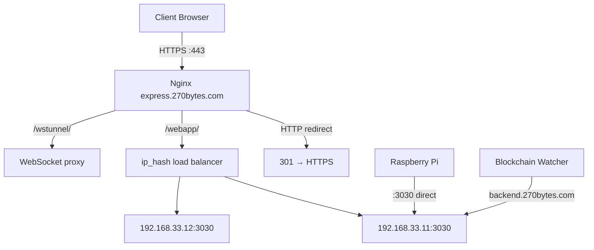

# Deployment

This guide covers production deployment with Nginx, the URLs used across components, and scaling considerations.

## Production URLs

| URL | Used By |
|-----|---------|
| `https://express.270bytes.com` | Public HTTPS endpoint (Nginx) |
| `http://express.270bytes.com:3030/api/weatherData` | IoT Pi POST target |
| `http://backend.270bytes.com/api/transaction` | Blockchain watcher POST target |
| `http://parity.270bytes.com:8545/` | Ethereum Parity JSON-RPC node |
| `contact@270bytes.com` | Contact email on landing page |

### On-Chain

| Resource | Value |
|----------|-------|
| Contract address | `0x48a9ca6e6cc7e5664ccc746213b3e3e6bf88e23d` |
| Network | Private Parity node |

### Database

| Resource | Value |
|----------|-------|
| Provider | MongoDB Atlas |
| Cluster | `Cluster0` (3-shard replica set) |
| Database | `weather` |

## Nginx Configuration

**File:** `ServersConfig/nginx/nodejs.conf`

### Overview



### HTTP → HTTPS Redirect

Port 80 redirects all traffic to HTTPS:

```nginx
server {
    listen 80;
    server_name express.270bytes.com;
    location / {
        return 301 https://$server_name$request_uri;
    }
}
```

### HTTPS Server

| Setting | Value |
|---------|-------|
| Port | 443 (HTTP/2) |
| SSL certificate | `/etc/nginx/ssl/certificate-name` |
| SSL key | `/etc/nginx/ssl/private-key` |
| Root `/` | 302 redirect to `/webapp/` |

### Load Balancing

Two Node.js instances behind an `ip_hash` upstream for session persistence:

```nginx
upstream nodejs {
    ip_hash;
    server 192.168.33.11:3030;
    server 192.168.33.12:3030;
}
```

### Proxy Locations

| Location | Behavior |
|----------|----------|
| `/webapp/` | `proxy_pass` to upstream + `proxy_cache backcache` |
| `/wstunnel/` | WebSocket upgrade proxy |

### Caching

```nginx
proxy_cache_path /tmp/NGINX_cache/ keys_zone=backcache:10m;
```

The `backcache` zone (10 MB) caches responses from the Node.js upstream for `/webapp/` requests.

## Deploying the Backend

1. Install Node.js on each application server.
2. Clone the repository and install dependencies:

```bash
cd Website/BackEnd
npm install --production
```

3. Start the server (use a process manager for reliability):

```bash
PORT=3030 node ./bin/www
# or with pm2:
pm2 start bin/www --name nammumu-api
```

4. Repeat on each server in the upstream pool (`192.168.33.11`, `192.168.33.12`).

## Deploying the Frontend

1. Update the API base URL in `src/main.js` for production:

```javascript
axios.defaults.baseURL = 'https://express.270bytes.com/';
```

2. Build the static assets:

```bash
cd Website/frontend
npm install
npm run build
```

3. Serve `dist/` contents. Based on the Nginx config, the app is served under `/webapp/`. Configure your static file serving or proxy accordingly.

## Deploying the Blockchain Watcher

Run as a persistent background process on a server with network access to the Parity node:

```bash
cd BlockChain/Watcher
npm install
pm2 start index.js --name nammumu-watcher
```

Ensure the watcher can reach both the Parity node and the backend API.

## Deploying IoT Collectors

Each Raspberry Pi runs the collector as a systemd service or via `pm2`:

```bash
cd IOT/sensehat-pi
npm install
pm2 start index.js --name weather-station
```

The collector POSTs directly to port 3030, bypassing Nginx HTTPS. Ensure firewall rules allow the Pi to reach the backend.

## Scaling

### Horizontal Scaling

- Add more Node.js instances to the Nginx upstream block.
- `ip_hash` ensures a client always hits the same server (important for any server-side session state).
- MongoDB Atlas handles database scaling independently.

### Caching

- Nginx `proxy_cache` reduces load on the Node.js servers for `/webapp/` requests.
- Weather data aggregation queries run against MongoDB; consider adding indexes on `timestamp` and `coord.country_code` for large datasets.

### IoT Ingestion

- IoT collectors POST directly to `:3030`, distributing load across the upstream pool.
- The `/api/weatherData` endpoint has no rate limiting; consider adding middleware for production hardening.

## Security Considerations

The following items should be addressed before a production deployment:

| Item | Current State | Recommendation |
|------|---------------|----------------|
| MongoDB credentials | Hardcoded in `connector.js` | Move to environment variables |
| JWT secret | Hardcoded in `jwtConfig.js` | Use a strong, rotated secret via env var |
| API authentication | Most routes are unprotected | Add auth middleware to sensitive endpoints |
| Google Maps API key | Exposed in `state.js` | Restrict by IP/domain in Google Console |
| SSL certificates | Placeholder paths in Nginx config | Install real certificates (Let's Encrypt) |
| IoT endpoint | `/api/weatherData` accepts all POSTs | Add API key or IP whitelist |

## Monitoring

Recommended checks for a production deployment:

- Backend health: `GET https://express.270bytes.com/weatherData/`
- Watcher logs: verify `Sent` events are being captured and POSTed
- IoT heartbeat: confirm new `weather_data` documents appear every few seconds
- MongoDB Atlas: monitor connection count and query performance
- Nginx: check access and error logs for 5xx responses
