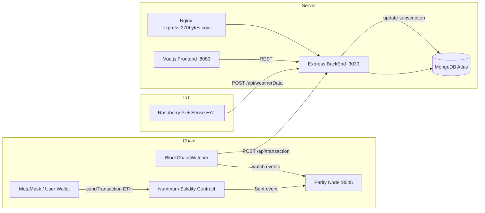

# Overview

Nammumu is a real-time weather monitoring platform that combines IoT weather stations, a Vue.js dashboard, and Ethereum subscription payments. Weather data flows from Raspberry Pi sensors into a MongoDB-backed Express API, while payments on the blockchain unlock map access for registered users.

## Architecture

## Components

| Component | Path | Role |
|-----------|------|------|
| Smart contract | `BlockChain/Contract/` | Accepts ETH payments, emits `Sent` events |
| Event watcher | `BlockChain/Watcher/` | Listens for on-chain events, forwards to the API |
| IoT collector | `IOT/sensehat-pi/` | Reads Sense HAT sensors, POSTs weather JSON |
| REST API | `Website/BackEnd/` | Express server on port **3030** |
| Dashboard | `Website/frontend/` | Vue 2 + Vuetify on port **8080** |
| Reverse proxy | `ServersConfig/nginx/` | HTTPS termination and load balancing |

## Data Flow

### Weather ingestion

1. A Raspberry Pi with a Sense HAT reads temperature, humidity, and pressure every 3 seconds.
2. The collector POSTs a JSON payload to `/api/weatherData`.
3. The backend stores the reading in MongoDB, linked to a geographic **State** document.

### Dashboard consumption

1. Users authenticate via password or MetaMask wallet signature.
2. The Vue frontend fetches aggregated heatmap data from `/weatherData/fullMap`.
3. Users drill down from world map → country → state for detailed readings.

### Subscription payments

1. Users visit `/pricing` and pay ETH via MetaMask to the deployed `Nummum` contract.
2. The contract fallback function validates the exact payment amount and emits a `Sent` event.
3. The blockchain watcher catches the event and POSTs transaction details to `/api/transaction`.
4. The backend extends the user's subscription (`apiExpirationDate`) or adds API tickets (`token_balance`).

## Access Control

| Role | Behavior |
|------|----------|
| **client** | Can view maps if `token_balance > 0` or `apiExpirationDate` is in the future; otherwise redirected to `/pricing` |
| **admin** | Redirected from `/map` to `/admin/userlist`; manages users, stations, prices, and transactions |

## Technology Stack

| Layer | Technology |
|-------|------------|
| IoT | Node.js, `node-sense-hat` |
| Backend | Express 4, Mongoose 5, Passport JWT |
| Frontend | Vue 2, Vuetify, Highcharts, Web3 |
| Blockchain | Solidity 0.4, Web3.js 0.20 |
| Database | MongoDB Atlas |
| Proxy | Nginx with SSL and `ip_hash` load balancing |

## Further Reading

- [Getting Started](../README.md#getting-started) — run all components locally
- [Blockchain](./blockchain.md) — contract and watcher details
- [IoT](./iot.md) — Raspberry Pi station setup
- [Website](./website.md) — frontend and backend structure
- [API Reference](./api.md) — endpoints and data models
- [Deployment](./deployment.md) — production configuration
